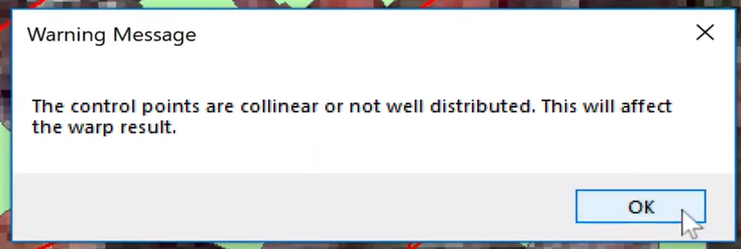

# Georeferencing an Image using ArcMap 10.6

00m16s http://bit.ly/luiscberrocal_georeferencing

01m07s Image not geo referenced

01m48s Activate Georeferencing tools

02m12s Fit to display

02m37s Zoom to admin building

03m11s Click image first then vector

04m09s

04m27 Viewer

05m28s Control Points, Affine Transformation

06m05s Rectify

06m06s  Cell Size

06m07s Bilinear Interpolation

08m37s Properties, Source

08m52s Spatial Reference